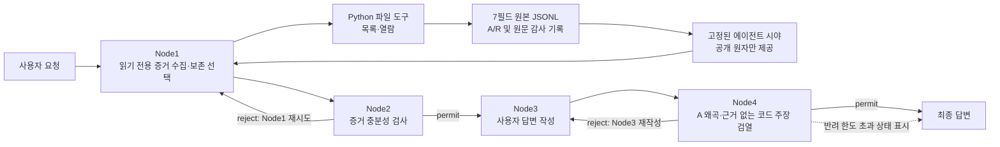

# SongRyeon Core v1 결과보고서 원고

> 상태: **공식 양식으로 옮기기 전 내부 초안**
>
> 이 문서는 현재 저장소에서 확인되는 구현만 설명한다. 페이지 수는 Markdown
> 기준이 아니므로, 공식 결과보고서로 편집할 때 본문 5쪽 이내인지 별도로
> 확인한다. 미확정 정보와 검토되지 않은 수치는 `TODO`로 표시했다.
> 제출 마감은 **2026-08-27 18:00**이며, 제출 직전에 참가자 페이지의 공지를
> 다시 확인한다.

## 기본 정보

| 항목 | 내용 |
|---|---|
| 작품명 | SongRyeon Core v1 |
| 접수번호 | `TODO` |
| 팀명 | `TODO` |
| 팀장·팀원 | `TODO` |
| 공개 저장소 | <https://github.com/Junghoo-developer/SongRyeon/tree/codex/contest-release-2026> |
| 제출 커밋·태그 | `TODO` |
| 시연 영상 | `TODO: 3분 이하 YouTube URL` |
| 소스 라이선스 | MIT License |

## 1. 개발 배경과 목적

LLM 에이전트는 도구를 실제로 실행한 결과와 모델이 해석하거나 추론한 내용을
하나의 대화 문맥에 섞기 쉽다. 이때 모델이 실행한 도구, 읽은 파일, 라우팅
결과와 같은 코드 확인 가능 사실까지 잘못 말하면 사용자는 결과의 출처와
동선을 추적하기 어렵다.

송련 코어 v1의 현재 목표는 세상의 모든 문장의 진위를 판정하는 것이 아니다.
대신 내장 실행 경로에서 다음 두 종류를 분리한다.

- **A(absolute information)**: 코드가 값의 존재와 내용을 그대로 확인할 수
  있는 실행 사실과 보존 원문
- **R(relative information)**: 사용자 발화, 모델의 판단·검토·답변처럼
  코드만으로 내용의 참·거짓을 확정할 수 없는 정보

LLM의 출력은 R로 남기고, “언제 어떤 노드가 어떤 도구를 실행해 무엇을
받았는가”는 코드가 A로 기록한다. 이 구분을 append-only JSONL 원본과 제한된
에이전트 시야, 네 단계의 노드 루프에 적용해 실행 동선을 감사할 수 있는
작은 로컬 에이전트 런타임을 만드는 것이 목적이다.

여기서 A는 세계에 대한 절대적 진리가 아니라 **해당 실행에서 코드가 직접
관측하고 보존한 사실**이다. A가 보장하는 범위를 넘어선 해석은 다시 R로
다룬다.

## 2. 개발 환경

| 구분 | 현재 구현 |
|---|---|
| 언어 | Python 3.10 이상 |
| 필수 Python 패키지 | 없음. 실행부는 Python 표준 라이브러리 사용 |
| 개발·테스트 의존성 | pytest 8 이상 |
| 로컬 모델 런타임 | Ollama HTTP 인터페이스 |
| 대회용 모델 프로필 | `gemma4:26b`, 로컬 또는 자체 호스팅 실행 |
| 비교 기준선 | `qwen3:14b` |
| 기억 저장 | UTF-8 JSONL |
| 지식 색인 | SQLite |

2026-07-30에 기록한 개발 환경은 Windows 11 Pro 64-bit(build 10.0.26200),
Intel Core i9-14900K, NVIDIA GeForce RTX 5080(16,303 MiB), 물리 메모리
63.69 GiB, Python 3.10.11, Ollama 0.32.5였다. 이는 관찰한 호스트일 뿐
최소 사양을 뜻하지 않는다. `gemma4:26b`는 Q4_K_M이며 전체 digest는
`5571076f3d70050487b26b341705799e0ab29b808164f90d20d4cf84f699d251`이다.
제출 시 같은 모델·환경인지 다시 확인한다. 최종 시연 환경과 전체 digest는
`TODO: 최종 제출 커밋 동결 후 재채취`다.

## 3. 시스템 구조



모든 노드는 턴 시작 시 선택된 기억의 가장 오래된 공개 원자를 기준점으로
공유한다. 최초 선택은 최신 약 8,000자 예산 안에서 **완전한 원자 단위**로
이루어지며, 턴 중에는 기준점을 앞으로 옮기지 않는다. 따라서 뒤쪽 노드가
앞쪽 노드가 본 원자를 문맥 절단 때문에 잃지 않는다.

## 4. 주요 기능

### 4.1 7필드 원자 기억과 파생 시야

원본 `memory.jsonl`의 각 줄은 다음 일곱 필드를 가진다.

`information`, `information_class`, `code_verifiable`,
`information_type`, `turn_id`, `information_id`, `created_at`

에이전트에게는 숨김 종류를 제외하고 `information`, `information_type`,
`information_class`, `code_verifiable`에 원본 물리 줄에서 파생한
`memory_index`를 붙여 제공한다. UUID와 생성 시각 등 원본 감사 정보는
원본에 유지하되 일반 시야에는 반복 노출하지 않는다.

### 4.2 원문 보존과 A/R 경계

도구 원문과 모델 입출력 원문은 원본 로그에 저장하지만 평상시 에이전트
시야에서는 숨긴다. Node1은 도구 결과를 검토한 뒤 `full`, `excerpt`,
결정론적 `chunk`, `omit` 중 하나를 요청한다. 실제 공개 본문은 모델이
다시 써 주는 것이 아니라 코드가 숨김 원문에서 그대로 복사한다. 성공한
결과가 모두 `omit`이면 Node2로 가기 직전 한 개 후보를 다시 고르는 복구
절차가 있다.

### 4.3 읽기 전용 파일 도구

Node1만 파일 도구를 사용할 수 있다. 현재 도구는 프로젝트 안의 Python
파일 목록 조회와 UTF-8 `.py` 원문 열람 두 가지다. 허용 루트는 런타임 코드가
고정하며 절대경로, 상위 경로 탈출, 심볼릭 링크를 통한 루트 이탈, 제외
폴더, Python 이외 파일과 크기 상한 초과를 코드가 거부한다.

### 4.4 유한한 네 노드 루프

- Node1: 한 라운드에 읽기 전용 도구를 최대 3회 사용하고 증거를 선택한다.
- Node2: 사용자 요청에 답하기 위한 A 증거가 충분한지 검사한다.
- Node3: 현재 요청에 직접 답하되 코드 사실과 R 제안을 구분한다.
- Node4: Node3의 구체적인 코드 주장을 공개된 A 원문과 대조한다.

Node2와 Node4는 각각 반려를 최대 3회 적용한다. 그 뒤에도 reject가 나오면
유한 종료를 위해 다음 단계로 진행하지만, 이를 permit으로 바꾸지 않는다.
결과 객체와 CLI 경고가 `node2_limit_exhausted` 또는
`node4_limit_exhausted` 상태를 명시한다.

### 4.5 외부 지식의 원본 보존과 색인

프로젝트 Python 소스와 `knowledge/documents/`의 허용된 UTF-8 텍스트 문서를
SQLite에 색인할 수 있다. 파일 경로, 본문, SHA-256, 추가·변경·삭제 상태를
관리하며 한 파일 버전의 내용도 원본 기억 로그에 보존한다. 현재 데모의
Node1 도구는 이 지식 DB 검색을 아직 제공하지 않는다.

### 4.6 재현 가능한 평가 골격

`evals/`에는 고정된 합성 프로젝트와 10개 case manifest, 정규화 결과 검사,
SHA-256 검증, 시스템별 집계가 있다. 기본 `python -m evals`는 모델을
호출하지 않는 **합성 fixture 계약 시험**이다. 그 완벽한 fixture 점수와
0 지연시간은 실제 모델 성능이 아니다. 실제 정량 결과는 원문 실행 로그를
보존하고 사람이 정규화한 뒤 별도 검토가 끝난 경우에만 기록한다.

과거 파일럿과 후속 탐색 실험은 원시 결과를 보존했지만 사람 검수와 최종
소스 동결이 끝나지 않은 자료가 포함되어 있다. `publishable: false` 또는
AI 예비 채점 상태의 결과는 성능 수치로 인용하지 않는다. 최종 보고서에
정량 수치를 넣을지는 `TODO: 참가자의 독립 검수 후 결정`이다.

## 5. 실행 및 시연 방법

```powershell
ollama serve
ollama pull gemma4:26b
python -m pip install -e ".[test]"
python -m pytest -q
python -m demo --memory .\.tmp\demo-video-memory.jsonl `
  "memory/record.py를 실제 도구로 읽고 기록의 일곱 필드와 A/R 분류 방식을 설명해 줘."
```

시연에서는 다음을 한 흐름으로 보여준다.

1. 사용자가 특정 Python 파일을 실제로 읽으라고 요청한다.
2. Node1의 도구 실행과 원문 보존 선택을 확인한다.
3. Node2의 증거 검사, Node3의 답변, Node4의 검열 결과를 확인한다.
4. 격리한 JSONL에 사용자 입력, 도구 동선, 선택 원문과 노드 판단이 서로
   다른 A/R 원자로 남은 것을 확인한다.

2026-08-06 현재 작업 트리에서 `python -m pytest -q -rs`는
`275 passed, 2 skipped`였다. 두 skip은 현재 Windows의 심볼릭 링크 생성
권한이 없어 건너뛴 경계 테스트다. 이는 중간 검증값이며 최종 제출 커밋의
성능 증거나 최종 통과 수치가 아니다. 제출 커밋을 확정한 뒤 깨끗한 clone에서
설치·전체 테스트·시연을 다시 실행하고 그 원본 출력과 정확한 수를 기록한다.

- 최종 Git SHA·태그: `TODO`
- 깨끗한 clone 전체 테스트 결과: `TODO`
- CI 결과 URL: `TODO`
- 실제 3분 이하 시연 영상 URL: `TODO`

## 6. 차별점과 기대 효과

송련의 차별점은 더 큰 프롬프트 하나로 모든 판단을 맡기지 않고, 모델의
서술과 코드의 실행 사실을 데이터 구조와 라우팅 코드에서 나누는 데 있다.

- 원본 감사 로그와 모델용 시야를 분리해 추적성과 문맥 비용을 함께 다룬다.
- 도구 원문을 모델이 재작성하지 않고 코드가 선택 구간 그대로 복사한다.
- 증거 충분성 검사와 최종 답변 검열을 별도 노드로 나눈다.
- 반복 상한을 코드가 적용하고, 상한 초과를 성공으로 위장하지 않는다.
- 로컬 또는 자체 호스팅 오픈웨이트 모델을 기본 실행 경로로 사용한다.

이 구조는 코드 리뷰·파일 조사형 에이전트에서 “실제로 무엇을 읽었는가”와
“모델이 무엇을 판단했는가”를 다시 확인할 수 있는 기반이 될 수 있다.
효과의 크기는 아직 사람이 검수한 최종 라이브 비교평가로 확정하지 않았다.
따라서 검수 전에는 “환각을 제거한다”, “정확도가 몇 % 향상된다” 같은 표현을
사용하지 않는다.

## 7. 한계와 향후 계획

현재 데모는 `.py` 파일 읽기에 집중하며 쓰기 도구는 없다. 외부 지식은
색인되지만 에이전트 검색 도구와 연결되지 않았고, 과거 기억 검색과 기억
압축도 아직 없다. JSONL은 단일 프로세스 writer를 전제로 하며, 긴 턴은
고정 기준점 이후 원자가 계속 누적되어 문맥이 커질 수 있다. 또한 모델
출력은 비결정적일 수 있고, 반려 한도 초과 시 답변은 반환되더라도 검증
미완료 상태다.

향후 우선순위는 다음과 같다.

1. 고정 case로 로컬 모델 비교평가를 실행하고 원문·정규화·집계를 공개
2. Node1에 과거 기억과 지식 DB의 제한된 검색 도구 추가
3. 원본을 보존하면서 파생 시야만 압축하는 기억 압축 계층 설계
4. 검증 미완료 답변의 사용자 표시와 재시도 정책 개선
5. 다중 writer가 필요해질 경우 파일 잠금 또는 중앙 writer 도입

## 8. AI 활용·라이선스·SBOM 공개

공식 대회 시연은 로컬 또는 자체 호스팅 Ollama의 `gemma4:26b`를 사용하며,
외부 API나 Codex 계정 모델은 자동 fallback이 아니다. 외부 모델 연결과
모델 체급 실험은 선택적인 개발·통합시험으로 격리하고 공식 로컬 성능
집계에서 제외한다. OpenAI Codex는 설계 토론뿐 아니라 코드·테스트·평가
도구·문서의 작성과 실행을 광범위하게 수행했다. 참가자는 문제와 A/R 철학,
노드 구조와 실험 질문을 정하고 실제 데모 출력·프롬프트·주요 코드 흐름을
반복 검수했으며, 최종 제출 주장과 변경 채택을 직접 승인한다.

Gemma 4 26B의 라이선스는 2026-08-06 로컬 `ollama show --license`, Ollama
공식 모델 페이지와 Google 공식 모델 카드에서 Apache License 2.0으로 교차
확인했다. 전체 digest, AI 코딩 보조 모델·사용 기간과 직접 의존성은
`ai_model_spec.md`와 `sbom.md`에서 최종 커밋 기준으로 공개하며, 최종 시연
직전 모델 digest를 다시 확인한다.

## 9. 개발 소감 초안

`TODO: 참가자가 직접 작성`

권장 내용은 “처음 문제를 어떻게 정의했는지”, “A/R 분리를 코드 구조로
옮기며 어떤 시행착오가 있었는지”, “테스트와 실제 로컬 모델 실행에서 무엇을
배웠는지”, “오픈소스로 공개하면서 다른 개발자가 무엇을 재현할 수 있게
했는지”다. 실제 경험만 적고 성능이나 수상 가능성을 추측해 쓰지 않는다.
